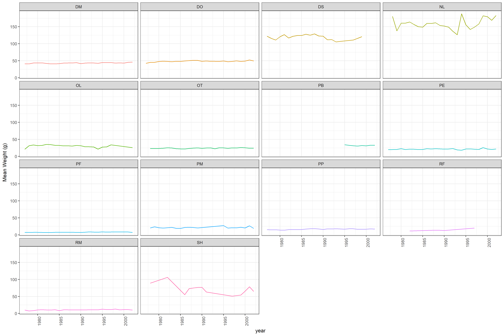

# 2017_Carpentry_workshop
Workshop in UC Merced August 17 & 18

# my-project

Playing with [Data Carpentry at UC Merced -  Yosemite](https://snacktavish.github.io/2017-08-17-Yosemite/).

## Introduction

This repository demonstrates **software** and _formats_:

1. **Git**
1. **Github**
1. _Markdown_
1. _Rmarkdown_

## Conclusion

